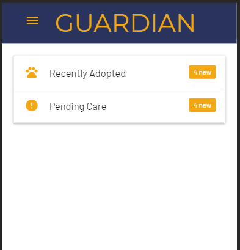
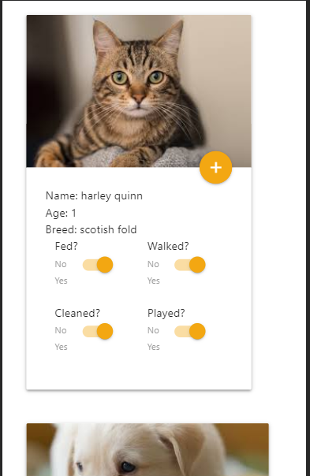
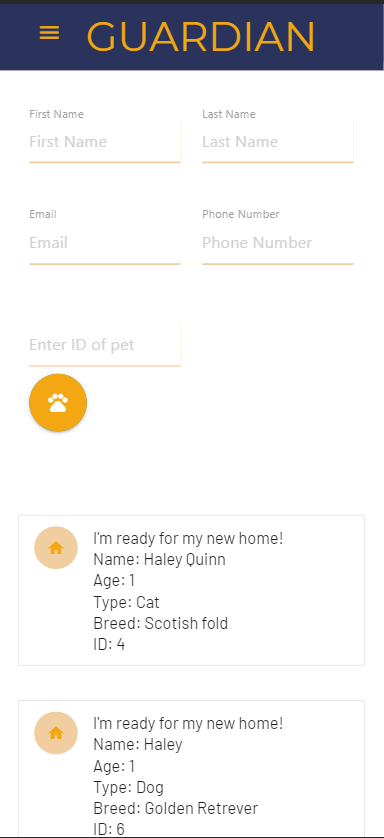

# Guardian

An system application for animal shelters that allows for basic administrative/operational functions i.e. animal care management, adoption registration and setup of database for animal profiles. Leveraging front and backend technologies, establishing a comprehensive database and seamless communication structure with client and server side information.

==== 

### Live Deployed

https://agile-mesa-62002.herokuapp.com/

## Getting Started

1. You will be directed to the homepage where you'll be notified of any recent adoption or animals that currently need care. 
2. Using the sidenav, navigating to 'Adoption' will show a form to adopt animals as well as all animals and their ID available for adoption. Use their ID to adopt that animal.
3. Under the 'Adopted' tab you will find all animals that have been previously been adopted along with a timestamp and their ID. 
4. Fill out the form under 'Intake' to accept any new animals into the shelter.
5.Under the animals page will have all the current animals and all the care require

### Technologies Used

 * MySQL - a database management system
 * Materialize CSS - UI component library
 * Javascript
 * HTML
 * CSS
 * Axios - promise based HTTP client for the browser and node.js
 
## Contributors 
* Sabrina Rocha https://github.com/delrock876
* Cyd Castillo https://github.com/CydVicious3
* Bryant Nguyen https://github.com/bnguyen78
* Francisco Raigoza https://github.com/Fraigoza200

